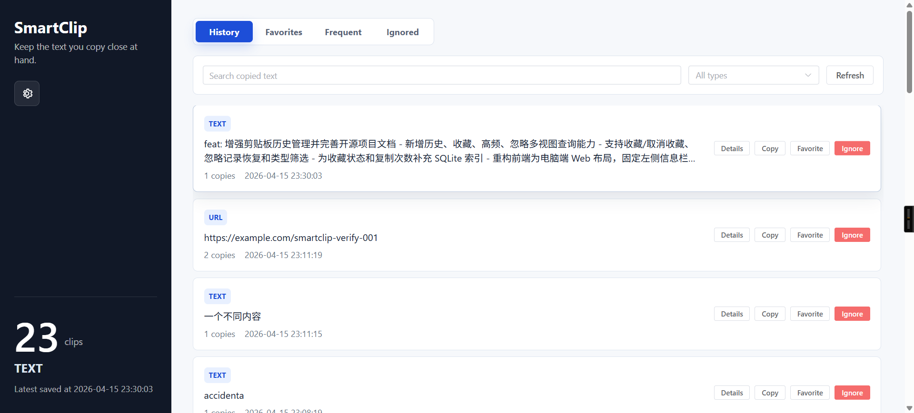

# SmartClip

SmartClip is a local-first Windows clipboard text history manager. It collects copied text on your machine, detects common text types, de-duplicates repeated content, and provides a desktop UI for search, favorites, detail viewing, tags, settings, and copying old content back to the system clipboard.

`Local-first` `Windows` `Spring Boot` `Vue 3` `Electron` `SQLite` `MIT License`



## Features

- Collects Windows clipboard text in the background.
- Stores data locally in SQLite; no account, cloud service, MySQL, or PostgreSQL required.
- Filters empty or very short text.
- De-duplicates by content hash and tracks copy counts.
- Records first copied time, last copied time, and copy events.
- Detects URL, JSON, SQL, command, Java exception logs, file paths, code snippets, and plain text.
- Provides history, favorites, frequent clips, and ignored clips views.
- Supports keyword search, type filtering, tag filtering, details, copy-back, ignore, restore, and favorites.
- Supports tag creation through clip tag editing.
- Provides settings for listener status, polling interval, minimum saved text length, and sensitive-content ignore behavior.
- Ships as an Electron desktop app with the Java backend and a slim JRE bundled.

## Download

For normal use, download the Windows installer from the GitHub Releases page:

```text
SmartClip-Setup-1.0.0.exe
```

The release also includes:

```text
SmartClip-Setup-1.0.0.exe.sha256
```

The installer is not code-signed yet, so Windows may show a security warning. This is expected for v1.0.0.

## Data And Privacy

SmartClip is local-first. Clipboard history is stored on your machine and is not uploaded by the app.

Desktop app data is stored under the current Windows user profile, for example:

```text
%APPDATA%\SmartClip\
```

The SQLite database is stored in that user-data area. Uninstalling the application does not necessarily delete user data; remove the user-data directory manually if you want a full cleanup.

## Run From Source

### Requirements

- Windows
- JDK 17
- Maven 3.9+
- Node.js 20+
- npm

### Start Backend

```powershell
cd E:\Documents\CodeSpace\forAI\SmartClip
$env:JAVA_HOME='E:\TOOL\Env\Java\jdk-17.0.8'
$env:Path="$env:JAVA_HOME\bin;$env:Path"
mvn spring-boot:run
```

The backend runs at:

```text
http://localhost:8080
```

### Start Frontend Development Server

```powershell
cd frontend
npm install
npm run dev
```

The Vite dev server proxies `/api` to the backend.

### Start Electron Development Shell

```powershell
cd desktop
npm install
npm run dev:web
```

This loads the Vite frontend in an Electron window and is the easiest mode for UI development.

## Build Desktop App Locally

Build the frontend and backend first:

```powershell
cd E:\Documents\CodeSpace\forAI\SmartClip
$env:JAVA_HOME='E:\TOOL\Env\Java\jdk-17.0.8'
$env:Path="$env:JAVA_HOME\bin;$env:Path"

cd frontend
npm install
npm run build

cd ..
mvn package
```

Prepare and package the Electron app:

```powershell
cd desktop
npm install
npm run prepare:app
npm run build:jre
npm run verify:layout
npm run pack
```

Run the unpacked desktop build:

```text
desktop\dist\win-unpacked\SmartClip.exe
```

Build the installer:

```powershell
npm run dist
```

The installer is generated at:

```text
desktop\dist\SmartClip-Setup-1.0.0.exe
```

## GitHub Release Build

This repository includes a GitHub Actions workflow that builds the Windows installer and publishes it to GitHub Releases when a tag matching `v*` is pushed.

Release flow:

```powershell
git tag v1.0.0
git push origin master
git push origin v1.0.0
```

The workflow builds:

- Frontend static assets
- Spring Boot backend jar
- Slim JRE runtime
- Electron Windows installer
- SHA256 checksum file

## Project Structure

```text
SmartClip/
|-- desktop/                         # Electron desktop shell and packaging scripts
|-- docs/                            # Project documentation and screenshots
|-- frontend/                        # Vue 3 frontend
|-- src/main/java/com/smartclip/      # Spring Boot backend source
|-- src/main/resources/db/migration/ # Flyway migrations
|-- src/main/resources/static/       # Built frontend assets served by Spring Boot
|-- data/                            # Local development SQLite data
|-- pom.xml                          # Maven configuration
`-- README.md
```

## Development Notes

- Do not commit local clipboard data or SQLite database files.
- Do not commit `node_modules`, `target`, `frontend/dist`, or `desktop/dist`.
- Frontend production builds must use relative asset paths (`./assets/...`) so Electron can load them from `file://`.
- Java must run with AWT headless mode disabled so it can access the Windows clipboard.

## FAQ

### Why does Windows show a warning when installing?

The v1.0.0 installer is not code-signed. Windows may warn about unknown publishers. This does not mean the app uploads data; it means the executable has no trusted signing certificate.

### Does SmartClip upload my clipboard content?

No. SmartClip stores clipboard history locally in SQLite.

### Can I run SmartClip without installing Java?

Yes, the Electron release bundles a slim JRE.

### Can I use SmartClip on macOS or Linux?

Not in v1.0.0. This release targets Windows.

## License

SmartClip is released under the MIT License. See [LICENSE](LICENSE).
